<p align="center">
  
</p>


<h1 align="center"> The Store</h1>
Queen St Market is an online store where the user can go shop for a product, view the details of said product, add it to the cart and then checkout. The user muct sign-up and log in in order to access the cart and checkout pages of the app. Once logged in their cart is saved until they are ready to checkout. If the user changed their mind about the quantity of products of if they decide to delete their cart they can do so with a few clicks. 

This is a MERN application (Mongo, Express, React and Node) and we will be detailling how we used these and other tools to build our Queen St Market application. 


<h1 align="center"> Getting Started</h1>

This was a collaboration project that took a lot of planning and several reassessments along the way. The first steps were to come to an agreement on where the project should go and what was our MVP (Minimal Viable Product).
To accomplish this we first created our User Stories.


<h2 align="center"> User Stories</h2>

Here are some of the user stories we came up with that helped us guide and initialize our project.

1. The user can log-in by accessing a form were they can input their information. 

2. They can logout by simply clicking on a navbar element.
3. The user can have access to our products without having to log-in.
4. The user can also view the details of a product by clicking a button that leads them to the product specifics also without having to log in. 
5. Each user has a personal cart that is protected by authentication. 
6. They can securely checkout with a dedicated application that especializes in credit card protection such as Stripe.
7. Their orders are stored so we can later remind them of their previous purchases. 
8. User is guided through the website effortlesly without feeling lost or not knowing where to go.


Once the User Stories were defined we moved on to decide how we wanted to build this application and which tools we were going to use.


<h2 align="center"> Why Mern?</h2>
When deciding how to build this aplication, a MERN APP seemed to be the perfect fit for us. 

A Mongo Database was the right choice since we did not need excessive realtional associations. The only relations were between the user and their cart and with the help of Mongoose we were able to create those simple relations with ease. 

Express being a server widly used made simple to integrate our back end elements such as mongoose, passport for our authentication and all our routes that worked with the front end through Axios calls. 

React was our front-end choice since we all wanted to gain some exprience with it. We decided to incorporate React Hooks as well. The fact that React is a full javascript library made it easier to integrate our UI the functionality of the app: We could build a card and have it update a product quantity of a product in the same file space. 

Finally we used Node to ease our development and allows to write our javascript code and test it right on our terminal. Node also made it possible to require our dependencies, export our files through module and use Command Lines to start our application, seed our database and much more. 

<h2 align="center"> Choosing our Dependencies</h2>

After deciding what type of application we wanted to build, the next step was to decide what dependencies we wanted to use to facilitate the process. There are many libraries to choose from and therefore we had to do our due dilligence and research which ones would better serve our needs. Our main research hub was the [NPM](https://www.npmjs.com/) website where all the packages we used have readmes with all the information we need to know about it. We also rely heavly on google and forums where other developers shared their experiences with these packages. 

<h1 align="center"> Sample Images</h1>

Before we launch ourselves in explaining our creation process, our codes highlights, challenges and process, we want to share our final MVP images and the fucntionality of the app in the GIF's below.

<h2 align="center">
 Sign-up, Log-in and Log-out </h2>

The user can sign-up and log-in to our store which allows them to have their own cart and to checkout safely. Tthey can also manually log-out if they so choose to. 

<p align="center">
  
</p>

___
<h2 align="center">
 Product Interaction </h2>

The user does not need to be authenticated in order to puruse the products or to view one product's details. In the product detail page, the user can adjust the quantity of the product before adding it to cart. 

<p align="center">
  
</p>

___

<h2 align="center">Cart Functionality </h2>

If the user is not logged -in or signed-up they cannot access the cart and will be prompted to log-in by a modal. Once in the cart, the user can update the quantity of a product which will change the total amount they need to pay, delete a product or checkout.

<p align="center">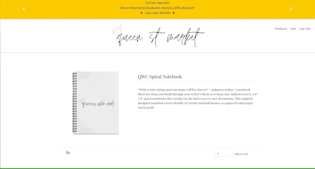
</p>

_ _ _

<h2 align="center">
 Checkout </h2>

Our checkout is executed by Stripe, the user will be prompted to input their email, their billing address and credit card information before performing the payment

<p align="center">
  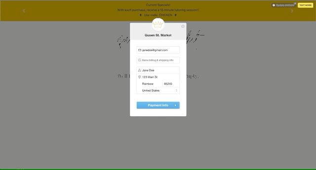
</p>

_ _ _

<h1 align="center">Server Side</h1>

In order to set up our back end, we had to start by installing the necessary dependencies. 

As stated previously, we chose Express to be our server, Mongo our database and Mongoose to be our ODM. 
We have Mongo installed goblally on our machines so we only had to install express and mongoose to initate our back-end.

```
npm install express
```
```
npm install mongoose
```

Once those were installed. The first step was to set up our server and make sure the assigned port was listening. Right after we set up our database and connected Mongoose as well. 

The next step was to set up our Mongo Schemas that would contain our data. 

<h2 align="center">Models</h2>

For our MERN Store we had set up four models:

+ User 
- Product
+ Cart 
- Order 

<h4 align="center">User Model</h4>

Our User Model was used to store the user information once they register. This was done to ensure that the user could have a cart, could log in to access protective routes and could checkout safely.

<h4 align="center">Product Model</h4>

The Product Model was very important since it was where we stored all of the products our store would sell. We decided to have only one seller and therefore we needed to seed pir database so the user had products to interact with as we demoed our application. 

<h4 align="center">Cart Model</h4>

The Cart Model was one of the most intricate models of this application. We needed two different ObjectIds to reference back to our user and the product they chose. We also needed to store the quantity the user chose for each product. 

In the beginning we had our product and quantity enclosed in a array of objects. This made extremely dificult to target the quantity specifically and make it possible to updated based on thr user needs. 

So eventually we had to pivot and change our model. The final model is the picture below. 

<p align="center">
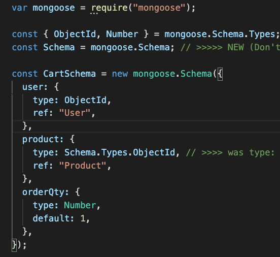</p>

<h4 align="center">Order Model</h4>

The Order Model is there to store the items the user purchased. In the future, one of the changes we would like to make in our store is to have an Account page where the user can choose to see previous orders they made, change passwords and other settings actions. 

___
<h2 align="center">Express Routes and Controllers</h2>

Once the server and the models were set up, we were able to start working on our first routes that would facilitate the communication between User input and Database actions. 

For organizational purposes we separated our routes from our model controllers. Our routes files require our controller routes so they can work together to achieve their work. 

These are some of our routes
<p align="center">
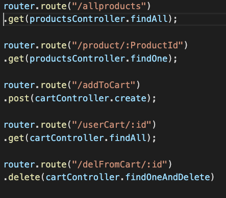</p>

This is an example of a function in our controller file. 
<p align="center">
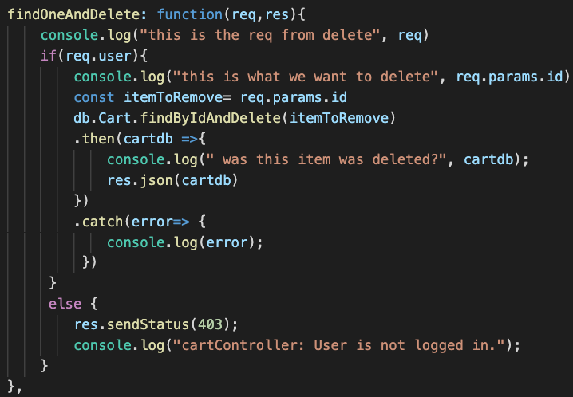</p>

___
<h1 align="center">Authentication</h1>

The Authentication of our store was done in the back-end of our application. We chose to go with passport due to its easy integration with Express. 

On order to have passport up and running we first had to install a few packages. 

We started by installing passport. 

```
npm install passport
```

Then we installed middleware. The package with the strategy we were going to use and a specific package that allows Express to monitor the user session.

```
npm install passport-local
```

```
npm install express-session
```

Once these dependencies were insalled we started by creating a folder where the passport configuration code would be written. This is just hard code that is part of how the Passport package functions. Since we decided to use a Local-Strategy we needed to implement specific code to configure passport to follow that strategy. 

Once that is set up then we move into creating routes that will be connecting to the front-end allowing the user to sign-up, log-in and log out as shown in the picture below.


<p align="center">
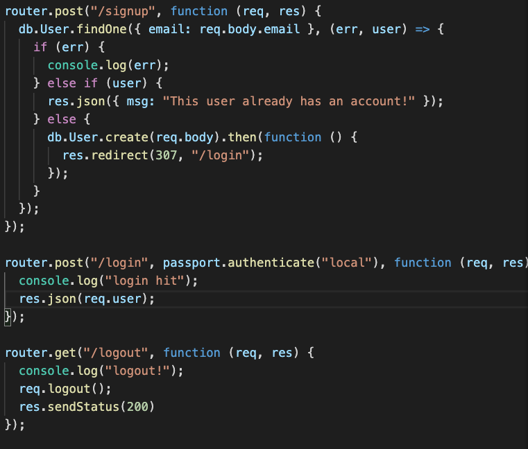</p>

Later we then use this user Authentication to also protect certain routes that a user could only access if they were logged in. Once we talk about our front-end we will show how we did that. 
_ _ _

<h1 align="center">Client Side</h1>

<h2 align="center">Creating the App</h2>
Our front-end template was React. since we had React installed globally on our machines, in order to create a new app instance we had to run this command:

```
create-react-app <app name>
```

Once the new app is installed we get to work. 

<h2 align="center">Axios</h2>

 We start by installing the dependencies we need to have our front-end be functional.

 We start with axios so we can communicate with our server

 ```
 npm install axios
 ```

 Everytime we have a route in our server trying to serve or receive some data from the front-end we do it through and axios call. 

 For folder structure organizational purposes we combined all of our axios calls in a util folder so we could reference them easily. 

<p align="center">
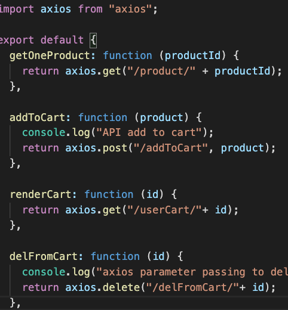</p>

_ _ _
<h2 align="center">React-Router-Dom</h2>

React allows to build React Routes that make the user travel between High order components that give the illusion of being different pages. To be able to do that we need to install the following dependency:

```
npm install react-router-dom
```
This dependency has a wide variety of components with many different functions.

In our app we used a few of them.

+ BrowserRoute: is the basic routing component that allows us to travel between different routes
- Switch: ensures that the user sees the route we want to specifically render. 
+ UseHistory: Is a hook that allows the navigation to maintain it's history. This was particularly useful in allowing the user to switch routes without being logged out. 
- Link: To link buttons and other components to specific React-Routes
+ UseParams: Another hook that help match the URL when components using Links were trying to connect. 
_ _ _
<h2 align="center">Bootstrap</h2>

For our UI we decided to go with a react-bootstrap package. 

```
npm install react-bootstrap
```
The benefit of this package is that instead of using a CDN Link in our root index.html folder, we could just import the components we intended to use like so:

<p align="center">
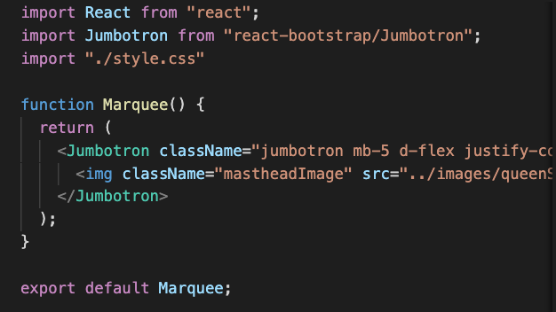</p>

However, to ensure this package works we still have to install the bootstrap package as well.

```
npm install bootstrap
```
in order to have the actual bootstrap CSS commands to work such as what is written in the className of the Jumbotron in the picture above we need then to import this package in the root index.js file of this app:

<p align="center">
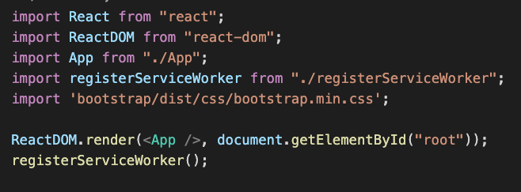</p>

_ _ _

<h2 align="center">React Hooks</h2>

In this application instead of using classes we decided to use Hooks. 

The two main hooks we used were:

+ useState
- useEffect

These hooks are now integrated in the app react so we did not need to install a package. We did however need to import them.

```
import React, { useState, useEffect } from "react";
```
We used these hooks for anything we wanted to manipulate on our page. 

For instances, to protect our routes we created a useState for our user that we passed down as props to any HOCs that we wanted to be accessible only when the user was logged in.

<p align="center">
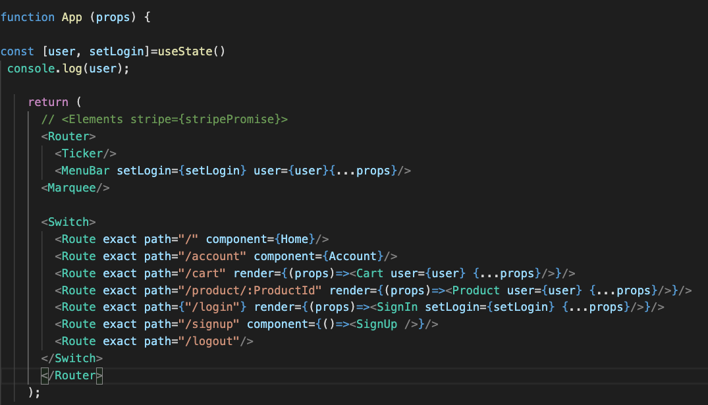</p>

We also used useState to track any updates or modifications from our user input. 
In our Cart page, for instance our user can delete the products they have selected to buy or modify the quantity desired. 

We then use useEffect to render those changes we have received from or sent to the database. 

Below are some examples of the usage of useState and useEffect in our app.

This is how we declared all of our useState variables and functions. It is important to note that some of them did not need variables only the function functionality since the variable cart had all of the user products in them. 

<p align="center">
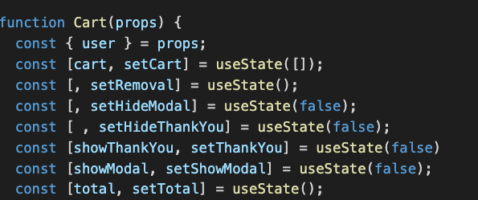</p>

_ _ _

This is how we set up our function that renders the products chosen by the user and concurrently tracks the amount they need to pay.

<p align="center">
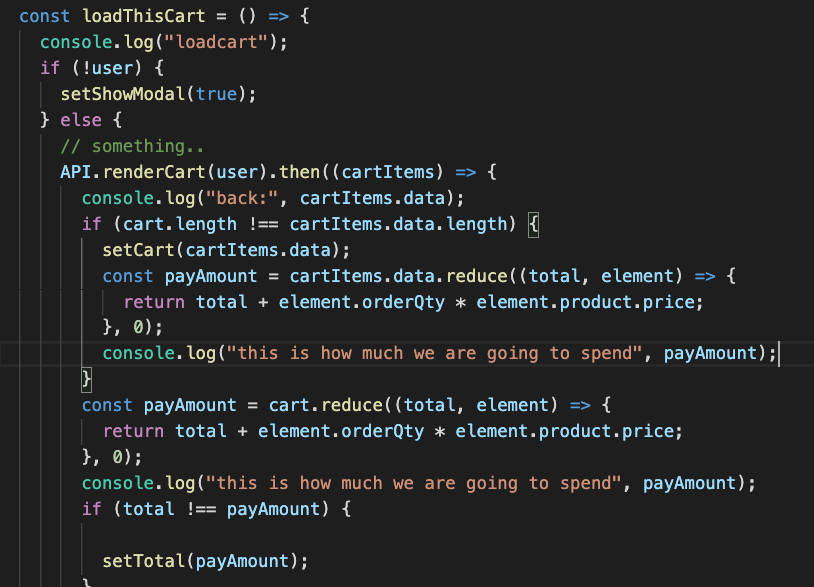</p>

_ _ _

This is how we use the UseEffect to render our page. Note that we keep track of the variable cart in the array portion of this function. So any changes that occurs with the products, this function will take into consideration. However, in order for these changes to appear in the page, we need to setCart (the useState function) so the useEffect knows to take those changes into account. 

<p align="center">
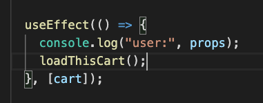</p>

_ _ _

In this example we show how we use the useState to update quantity in a function and setCart to trigger a page re-render. It is important that the page re-renders and not reloads, otherwise our user would be logged-out every time they make a change.

<p align="center">
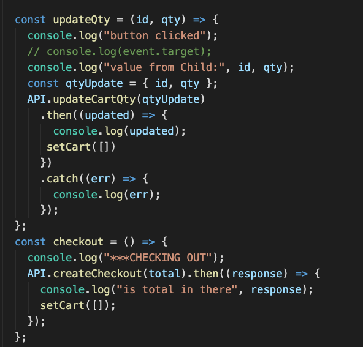</p>

_ _ _

<h1 align="center">Note from Author</h1>

There were many other aspects to creating this app and although I can't go over all of them, I can say that the ones I have outlined are the foundations of our app.

_ _ _

<h1 align="center">The Products</h1>

We decided to create our own products to put in this store. Since we were all graduating from a Bootcamp, we decided to create a themed store with memories from our time in this program related to coding. We used [Threadless](https://www.threadless.com/face-masks/?thref=Search_Brand&gclid=Cj0KCQjw0rr4BRCtARIsAB0_48OgT6mWCPEJ7z7u-SoM7xVuacpVE2zQ3XJIVW7Ljf3R8rryzBPgbpwaAh0jEALw_wcB) to create them and [cloudinary](https://cloudinary.com/) to create the images displaying on our website.

These products are actually for sale and the website where they were created and you can access them through this link.

[Queen-St-Market Products](https://queenstmarket.threadless.com/)

_ _ _

<h1 align="center">Technologies</h1>

+ React
- React-Router-Dom
+ React-Bootstrap
- Axios
+ React Hooks
- React-Stripe-Checkout
+ Express
- Passport
- bCryptjs
+ Passport-Local
- Express-Sessions
+ Stripe
- Mongoose
+ Mongo DB
- Javascript 
+ UUID
- Cors
+ dotenv
- if-env
+ Concurrently
- nodemon

<h1 align="center">Heroku Deployed Link</h1>

[Queen-St-Market](https://queen-st-market.herokuapp.com/)

<h1 align="center">Creators</h1>

+ Jennifer Kruk : [Portfolio](https://jenkruk.github.io/Portfolio/)
- Sara Neves Pereira: [Portfolio]( https://saranp-33.github.io/bootstrap-portfolio/)
+ Lindsey Tummond: [Portfolio]( https://lindseytummond.github.io/portfolio/)
- Niasha Ablago-Grant: [Portfolio]( https://niashagrant.github.io/updatedPortfolio/)

